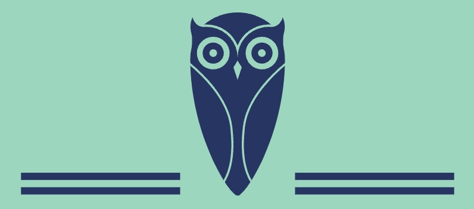

# Fair Share - Client
 

## Introduction

Fair share is the culmination of the knowledge that Kiowa and myself have acquaired in Ironhacks's web development bootcamp. This application aims to provide a structured and scalable way to handle expenses of any kind through groups, users and expense type management.

The application is built on react and its entire functionalities expand across the MERN tech stack (see below), and uses also other different technologies that we will review below in more detail:

* [MongdoDB](https://www.mongodb.com/)
* [Express](https://expressjs.com/)
* [React](https://react.dev/)
* [Node](https://nodejs.org/en)

## Functionalities

1. App performs major CRUD (create, read, update, delete) operations.
2. User creation and user management functionalities.
3. The app only allows users that are logged in to navigate the backend resources, otherwise they are requested to signup or login.
4. Different groups can be created and edited with multiple users.
    * Groups can only be edited by group admins i.e. the person who created the group.
    * Group admin can be edited by the initial group admin.
    * Users can only see the groups that they are part of, i.e: there is not cross-data sharing among users.
    * User can upload a specific picture for the group.
5. Expenses can be created and added to previously created groups
    * Only expense author (which is the expense creator) can edit the expense.
    * When adding an expense the user is asked to select in which group it will belong, then it only populates those users that are part of the group to avoig adding users that are not part of the group list.
    * User can upload and edit a specific picture for the invoice (e.g. invoice).
6. The app calculates different metrics such as balance, borrowed money or paid money to provide a comprehensive snapshot of the user status with all the groups
    * These numbers are provided at group level and also in a general manner

## Tech Stack
- `MongoDB`
    - Non-relation database used to store the app information.
- `React`
    - JS front-end framework used to build the client app.
- `Vite`
    - Project generator for setting up the react application
- `Javascript`
    - Main language used to develop this software.
- `Axios`
    - JS Library used to fetch data from back-end to client.
- `Supabase`
    - Service used to allow users upload their own pictures.
- `Deloplyment`
    - [Netlify](https://app.netlify.com/) -- Front-end deployment
    - [Vercel](https://vercel.com/) -- Back-end deployment

## Version History
Check the list of [commits](https://github.com/kiowafg/fair-share-client/commits/main/) to see the history of the versions or the design history of our app.

## Authors
- Lee Kiowa Roy Fiala
    - [LinkedIn](https://www.linkedin.com/in/lee-kiowa-fiala/)
    - [GitHub](https://github.com/kiowafg/)
- Alvaro Sarria Rico
    - [LinkedIn](https://www.linkedin.com/in/alsarria-dev/)
    - [GitHub](https://github.com/alvsarria)

## Acknowledgements
- Marcel Bosch Espin
- Nisol Medina Perozo
- Tania Futakova
- Mikel Jimenez Calcedo
- Arnaldo Mera Rojas